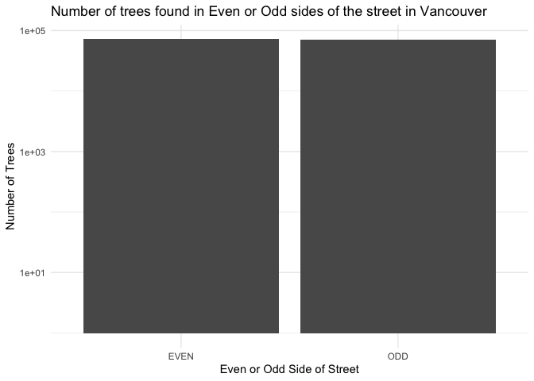
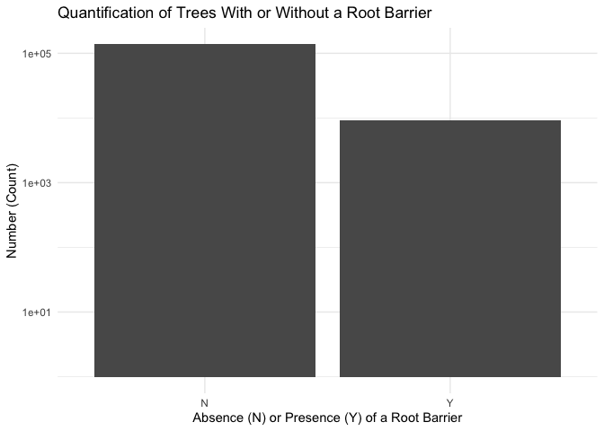
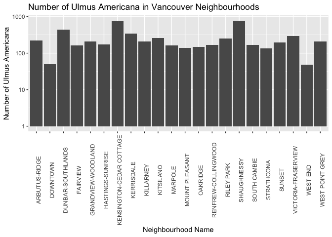
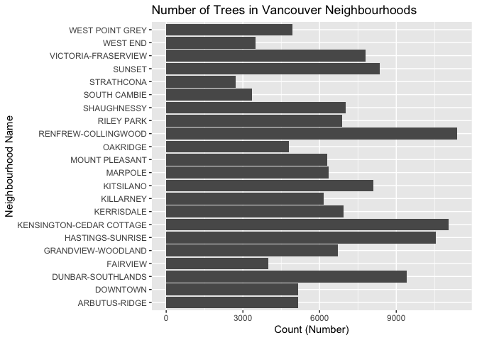

Mini Data Analysis Milestone 2
================

*To complete this milestone, you can either edit [this `.rmd`
file](https://raw.githubusercontent.com/UBC-STAT/stat545.stat.ubc.ca/master/content/mini-project/mini-project-2.Rmd)
directly. Fill in the sections that are commented out with
`<!--- start your work here--->`. When you are done, make sure to knit
to an `.md` file by changing the output in the YAML header to
`github_document`, before submitting a tagged release on canvas.*

# Welcome back to your mini data analysis project!

This time, we will explore more in depth the concept of *tidy data*, and
hopefully investigate further into your research questions that you
defined in milestone 1.

**NOTE**: The main purpose of the mini data analysis is to integrate
what you learn in class in an analysis. Although each milestone provides
a framework for you to conduct your analysis, it’s possible that you
might find the instructions too rigid for your data set. If this is the
case, you may deviate from the instructions – just make sure you’re
demonstrating a wide range of tools and techniques taught in this class.

Begin by loading your data and the tidyverse package below:

``` r
library(datateachr) # <- might contain the data you picked!
library(tidyverse)
```

# Learning Objectives

By the end of this milestone, you should:

-   Become familiar with manipulating and summarizing your data in
    tibbles using `dplyr` and `tidyr`, with a research question in mind.
-   Understand what *tidy* data is, and how to create it. In milestone
    3, we will explore when this might be useful.
-   Generate a reproducible and clear report using R Markdown.
-   Gain a greater understanding of how to use R to answer research
    questions about your data.

**Things to keep in mind**

-   Remember to document your code, be explicit about what you are
    doing, and write notes in this markdown document when you feel that
    context is required. Create your analysis as if someone else will be
    reading it! **There will be 2.5 points reserved for reproducibility,
    readability, and repo organization.**

-   Before working on each task, you should always keep in mind the
    specific **research question** that you’re trying to answer.

# Task 1: Process and summarize your data (15 points)

From milestone 1, you should have an idea of the basic structure of your
dataset (e.g. number of rows and columns, class types, etc.). Here, we
will start investigating your data more in-depth using various data
manipulation functions.

### 1.1 (2.5 points)

First, write out the 4 research questions you defined in milestone 1
were. This will guide your work through milestone 2:

<!-------------------------- Start your work below ---------------------------->

1.  Is there a significant difference in the number of trees between the
    different sides of the street (EVEN vs. ODD) in Vancouver? I would
    be interested in seeing if there is any difference in the frequency
    of trees between the EVEN and ODD sides of Vancouver streets and if
    this difference is statistically significant. NOTE - I had to modify
    this question from Milestone 1 as there are not enough decimals in
    the longitude to differentiate between East or West sides.
2.  Does the presence of a root barrier affect the diameter of trees?
    Root barriers are structures that are meant to guide tree roots down
    and away from human-made structures (e.g. building foundations, gas
    pipes, electrical wires). I am interested to see if these root
    guides have any affect on the diameter of trees.
3.  Is there a difference in the frequency of tree species within a
    specific genus in a neighbourhood of interest? Within a specified
    neighbourhood (e.g. Riley Park), and within a given genus of
    interest (e.g. Prunus), are there any differences in the frequency
    among tree species?
4.  Are there any differences in the height range of all trees between
    neighbourhoods in Vancouver? Neighbourhoods have a lot of
    differences, including local climates, levels of urbanization, and
    proximity to bodies of water (among others). I would like to see if
    there is any statistically significant difference in the mean number
    of trees among Vancouver’s neighbourhoods.
    <!----------------------------------------------------------------------------->

### 1.2 (10 points)

Now, for each of your four research questions, choose one task from
options 1-4 (summarizing), and one other task from 4-8 (graphing). You
should have 2 tasks done for each research question (8 total). Make sure
it makes sense to do them! (e.g. don’t use a numerical variables for a
task that needs a categorical variable.). Comment on why each task helps
(or doesn’t!) answer the corresponding research question.

Ensure that the output of each operation is printed!

**Summarizing:**

1.  Compute the *range*, *mean*, and *two other summary statistics* of
    **one numerical variable** across the groups of **one categorical
    variable** from your data.
2.  Compute the number of observations for at least one of your
    categorical variables. Do not use the function `table()`!
3.  Create a categorical variable with 3 or more groups from an existing
    numerical variable. You can use this new variable in the other
    tasks! *An example: age in years into “child, teen, adult, senior”.*
4.  Based on two categorical variables, calculate two summary statistics
    of your choosing.

**Graphing:**

5.  Create a graph out of summarized variables that has at least two
    geom layers.
6.  Create a graph of your choosing, make one of the axes logarithmic,
    and format the axes labels so that they are “pretty” or easier to
    read.
7.  Make a graph where it makes sense to customize the alpha
    transparency.
8.  Create 3 histograms out of summarized variables, with each histogram
    having different sized bins. Pick the “best” one and explain why it
    is the best.

Make sure it’s clear what research question you are doing each operation
for!

<!------------------------- Start your work below ----------------------------->

### Research Question 1

#### SUMMARIZING: Compute the number of observations for at least one of your categorical variables: species_name and genus_name

The code below will return the number unique species represented in the
dataset. This doesn’t really help me answer my research question, but it
does give me a sense of the taxonomic diversity of this dataset.

``` r
unique_species <- vancouver_trees %>% group_by(species_name) %>% summarize(count = n())
print(paste0("The number of unique species in the dataset is ", nrow(unique_species)))
```

    ## [1] "The number of unique species in the dataset is 283"

``` r
unique_genera <- vancouver_trees %>% group_by(genus_name) %>% summarize(count = n())
print(paste0("The number of unique genera in the dataset is ", nrow(unique_genera)))
```

    ## [1] "The number of unique genera in the dataset is 97"

The code below will return the number of observations where the species
name is “Americana”. This also doesn’t really help me answer the
research question, but does give me some practice quantifying the
frequency of a given value for a given variable.

``` r
num_Americana <- sum(with(vancouver_trees, species_name == "AMERICANA"))
print(paste0("The number of observations where the species name is 'AMERICANA' is ", num_Americana))
```

    ## [1] "The number of observations where the species name is 'AMERICANA' is 5515"

#### GRAPHING: The following code will display the number of trees found in the EVEN side of the streets compared to the ODD side of the streets in Vancouver then graph it with a logarithmic y-axis. The helps me answer this research question by allowing me to compare the number of trees that appear on the EVEN or ODD sides of streets in Vancouver.

``` r
even_vs_odd <- vancouver_trees %>% select(street_side_name) %>%  summarize(num_odd = sum(street_side_name == "ODD"), num_even = sum(street_side_name == "EVEN"))
print(even_vs_odd)
```

    ## # A tibble: 1 × 2
    ##   num_odd num_even
    ##     <int>    <int>
    ## 1   71374    71753

``` r
vancouver_trees %>% filter(street_side_name %in% c("EVEN", "ODD")) %>% ggplot(aes(x = street_side_name)) + 
  geom_bar() +
  scale_y_continuous(trans = "log10") +
  xlab("Even or Odd Side of Street") +
  ylab("Number of Trees") +
  ggtitle("Number of trees found in Even or Odd sides of the street in Vancouver") +
  theme_minimal()
```

<!-- -->

### Research Question 2

#### SUMMARIZING: Compute the number of observations for at least one of your categorical variables.

The following code allows me to quantify how many trees do and do not
have a root barrier. This helps me with the research question as I will
be comparing the diameter of trees with and without root barriers.

``` r
no_root_barrier <- sum(with(vancouver_trees, root_barrier == "N"))
has_root_barrier <- sum(with(vancouver_trees, root_barrier == "Y"))
print(paste0("The number of trees that have a root barrier is ", has_root_barrier, " and the number of trees that do not have a root barier is ", no_root_barrier))
```

    ## [1] "The number of trees that have a root barrier is 9156 and the number of trees that do not have a root barier is 137455"

#### GRAPHING: Create a graph of your choosing, make one of the axes logarithmic, and format the axes labels so that they are “pretty” or easier to read.

The code below will generate a bar graph comparing the number of trees
with and without a root barrier. This also helps me answer the research
question by giving me a visual sense of how many trees do and do not
have a root barrier.

``` r
vancouver_trees %>% filter(root_barrier %in% c("N", "Y")) %>% ggplot(aes(x = root_barrier)) +
  geom_bar() +
  scale_y_continuous(trans = "log10") +
  xlab("Absence (N) or Presence (Y) of a Root Barrier") +
  ylab("Number (Count)") +
  ggtitle("Quantification of Trees With or Without a Root Barrier") +
  theme_minimal()
```

<!-- -->

### Research Question 3

#### SUMMARIZING: Based on two categorical variables, calculate two summary statistics of your choosing.

The code below will calculate the mean and range of the frequency of
ULMUS AMERICANA among neighbourhoods in Vancouver. It will first create
a tibble that returns the number of ULMUS AMERICANA per neighbourhood.
This code helps me build a pipeline for calculating summary statistics
that will help me answer this research question.

``` r
# One caveat I noticed with the code immediately below when I was doing my corrections to Milestone 2 is that doesn't only look at ULMUS AMERICANA - it quantifies species called "AMERICANA" in any genus.  If I wanted to look specifically at ULMUS AMERICANA, I would also run the code that is commented out below.
freq_ulmus_americana <- vancouver_trees %>% 
# filter(genus_name == "ULMUS) %>%   
  filter(species_name == "AMERICANA") %>% 
  group_by(neighbourhood_name) %>% 
  summarise(ulmus_americana_per_neighbourhood = n())

print(freq_ulmus_americana)
```

    ## # A tibble: 22 × 2
    ##    neighbourhood_name       ulmus_americana_per_neighbourhood
    ##    <chr>                                                <int>
    ##  1 ARBUTUS-RIDGE                                          225
    ##  2 DOWNTOWN                                                50
    ##  3 DUNBAR-SOUTHLANDS                                      435
    ##  4 FAIRVIEW                                               165
    ##  5 GRANDVIEW-WOODLAND                                     208
    ##  6 HASTINGS-SUNRISE                                       175
    ##  7 KENSINGTON-CEDAR COTTAGE                               747
    ##  8 KERRISDALE                                             340
    ##  9 KILLARNEY                                              206
    ## 10 KITSILANO                                              260
    ## # … with 12 more rows

``` r
mean_americana <- freq_ulmus_americana %>% summarize(mean = mean(ulmus_americana_per_neighbourhood))
print(paste0("The mean number of Ulmus Americana among Vancouver's neighbourhoods is ", mean_americana))
```

    ## [1] "The mean number of Ulmus Americana among Vancouver's neighbourhoods is 250.681818181818"

``` r
range_americana <- freq_ulmus_americana %>% summarize(range = range(ulmus_americana_per_neighbourhood))
print(paste0("The range of the frequency of Ulmus Americana among Vancouver's neighbourhoods is ", range_americana))
```

    ## [1] "The range of the frequency of Ulmus Americana among Vancouver's neighbourhoods is c(49, 780)"

``` r
# This code contains corrections based on the TA feedback for Milestone 2
# Based on the feedback, I need to calculate summary statistics on two categorical variables.  So here is the calculation of summary statistics for another categorical variable, genus_name.
freq_ulmus <- vancouver_trees %>% 
  filter(genus_name == "ULMUS") %>% 
  group_by(neighbourhood_name) %>% 
  summarise(ulmus_per_neighbourhood = n())

print(freq_ulmus)
```

    ## # A tibble: 22 × 2
    ##    neighbourhood_name       ulmus_per_neighbourhood
    ##    <chr>                                      <int>
    ##  1 ARBUTUS-RIDGE                                159
    ##  2 DOWNTOWN                                      18
    ##  3 DUNBAR-SOUTHLANDS                            468
    ##  4 FAIRVIEW                                     127
    ##  5 GRANDVIEW-WOODLAND                           269
    ##  6 HASTINGS-SUNRISE                               1
    ##  7 KENSINGTON-CEDAR COTTAGE                      32
    ##  8 KERRISDALE                                   270
    ##  9 KILLARNEY                                     48
    ## 10 KITSILANO                                    142
    ## # … with 12 more rows

``` r
mean_ulmus <- freq_ulmus %>% summarize(mean = mean(ulmus_per_neighbourhood))
print(paste0("The mean number of Ulmus among Vancouver's neighbourhoods is ", mean_ulmus))
```

    ## [1] "The mean number of Ulmus among Vancouver's neighbourhoods is 130.045454545455"

``` r
range_ulmus <- freq_ulmus %>% summarize(range = range(ulmus_per_neighbourhood))
print(paste0("The mean number of Ulmus among Vancouver's neighbourhoods is ", range_ulmus))
```

    ## [1] "The mean number of Ulmus among Vancouver's neighbourhoods is c(1, 646)"

#### GRAPHING: Create a graph of your choosing, make one of the axes logarithmic, and format the axes labels so that they are “pretty” or easier to read.

The code below will make a graph that shows the distribution of the
frequency of Ulmus Americana among Vancouver’s neighbourhoods. This is
also provides a pipeline that I can use for further analyses for this
research question.

``` r
vancouver_trees %>% filter(species_name == "AMERICANA") %>% ggplot(aes(neighbourhood_name)) +
  geom_histogram(stat = "count") +
  ggtitle("Number of Ulmus Americana in Vancouver Neighbourhoods") +
  ylab("Number of Ulmus Americana") +
  xlab("Neighbourhood Name") +
  theme(axis.text.x = element_text(angle = 90)) +
  scale_y_continuous(trans = "log10")
```

    ## Warning: Ignoring unknown parameters: binwidth, bins, pad

<!-- -->

### Research Question 4

#### SUMMARIZING: Compute the *range*, *mean*, and *two other summary statistics* of **one numerical variable** across the groups of **one categorical variable** from your data.

The code below will calculate the mean of the heights of trees
represented in this dataset.

``` r
# This code contains corrections based on the TA feedback for Milestone 2
# It will return a tibble that has the mean of the heights of the trees, by neighbourhood_name.
height_mean_v2 <- vancouver_trees %>% group_by(neighbourhood_name) %>%summarize(mean_height = mean(height_range_id))
print(height_mean_v2)
```

    ## # A tibble: 22 × 2
    ##    neighbourhood_name       mean_height
    ##    <chr>                          <dbl>
    ##  1 ARBUTUS-RIDGE                   2.72
    ##  2 DOWNTOWN                        2.44
    ##  3 DUNBAR-SOUTHLANDS               3.03
    ##  4 FAIRVIEW                        2.80
    ##  5 GRANDVIEW-WOODLAND              2.60
    ##  6 HASTINGS-SUNRISE                2.46
    ##  7 KENSINGTON-CEDAR COTTAGE        2.60
    ##  8 KERRISDALE                      2.81
    ##  9 KILLARNEY                       2.50
    ## 10 KITSILANO                       3.26
    ## # … with 12 more rows

The code below will return the range of the heights of trees represented
in this dataset.

``` r
# This code contains corrections based on the TA feedback for Milestone 2
# It will return a tibble that has the range of the heights of the trees, by neighbourhood_name.
height_range_v2 <- vancouver_trees %>% group_by(neighbourhood_name) %>% summarize(height_range = range(height_range_id))
```

    ## `summarise()` has grouped output by 'neighbourhood_name'. You can override using the `.groups` argument.

``` r
print(height_range_v2)
```

    ## # A tibble: 44 × 2
    ## # Groups:   neighbourhood_name [22]
    ##    neighbourhood_name height_range
    ##    <chr>                     <dbl>
    ##  1 ARBUTUS-RIDGE                 0
    ##  2 ARBUTUS-RIDGE                10
    ##  3 DOWNTOWN                      0
    ##  4 DOWNTOWN                      8
    ##  5 DUNBAR-SOUTHLANDS             0
    ##  6 DUNBAR-SOUTHLANDS            10
    ##  7 FAIRVIEW                      0
    ##  8 FAIRVIEW                      9
    ##  9 GRANDVIEW-WOODLAND            0
    ## 10 GRANDVIEW-WOODLAND            9
    ## # … with 34 more rows

The code below will calculate the standard deviation of the height of
trees in this dataset.

``` r
# This code contains corrections based on the TA feedback for Milestone 2
# It will return a tibble that has the standard deivation of the heights of the trees, by neighbourhood_name.
height_sd_v2 <- vancouver_trees %>% group_by(neighbourhood_name) %>% summarize(height_sd = sd(height_range_id))
print(height_sd_v2)
```

    ## # A tibble: 22 × 2
    ##    neighbourhood_name       height_sd
    ##    <chr>                        <dbl>
    ##  1 ARBUTUS-RIDGE                 1.55
    ##  2 DOWNTOWN                      1.22
    ##  3 DUNBAR-SOUTHLANDS             1.93
    ##  4 FAIRVIEW                      1.52
    ##  5 GRANDVIEW-WOODLAND            1.56
    ##  6 HASTINGS-SUNRISE              1.40
    ##  7 KENSINGTON-CEDAR COTTAGE      1.42
    ##  8 KERRISDALE                    1.69
    ##  9 KILLARNEY                     1.26
    ## 10 KITSILANO                     1.86
    ## # … with 12 more rows

The code below will calculate the median of the height of trees in this
dataset.

``` r
# This code contains corrections based on the TA feedback for Milestone 2
# It will return a tibble that has the median of the heights of the trees, by neighbourhood_name.
height_median_v2 <- vancouver_trees %>% group_by(neighbourhood_name) %>% summarize(median_height = median(height_range_id))
print(height_median_v2)
```

    ## # A tibble: 22 × 2
    ##    neighbourhood_name       median_height
    ##    <chr>                            <dbl>
    ##  1 ARBUTUS-RIDGE                        2
    ##  2 DOWNTOWN                             2
    ##  3 DUNBAR-SOUTHLANDS                    2
    ##  4 FAIRVIEW                             3
    ##  5 GRANDVIEW-WOODLAND                   2
    ##  6 HASTINGS-SUNRISE                     2
    ##  7 KENSINGTON-CEDAR COTTAGE             2
    ##  8 KERRISDALE                           2
    ##  9 KILLARNEY                            2
    ## 10 KITSILANO                            3
    ## # … with 12 more rows

#### GRAPHING: Create a graph out of summarized variables that has at least two geom layers.

The code below will create a bar graph that shows the count of trees
present in each neighbourhood in Vancouver. I will be comparing the
height range of trees in Vancouver neighbourhoods for this research
question. This graph will give me a sense of the frequency of trees in
each Vancouver neighbourhood. Since neighbourhoods vary considerably
with regards to the number of trees they contain, it will be a caveat
during comparisons as there is a different sample size of trees from
each neighbourhood.

``` r
unique_neighbourhoods <- vancouver_trees %>% group_by(neighbourhood_name) %>% summarize(num = n())

unique_neighbourhoods %>% ggplot(aes(x = neighbourhood_name, y = num)) +
  geom_bar(stat = "identity") +
  coord_flip() +
  ggtitle("Number of Trees in Vancouver Neighbourhoods") +
  ylab("Count (Number)") +
  xlab("Neighbourhood Name")
```

<!-- -->

<!----------------------------------------------------------------------------->

### 1.3 (2.5 points)

Based on the operations that you’ve completed, how much closer are you
to answering your research questions? Think about what aspects of your
research questions remain unclear. Can your research questions be
refined, now that you’ve investigated your data a bit more? Which
research questions are yielding interesting results?

<!------------------------- Write your answer here ---------------------------->

**RESEARCH QUESTION 1** From Milestone 1, I initially wanted to
investigate the frequency of trees in the EAST vs. WEST sides of
Vancouver. Unfortunately, the longitude data is not accurate enough (not
enough decimal points) to differentiate between EAST and WEST sides. As
such, I modified the research question to look at the frequency of trees
between the different sides of the street - EVEN vs. ODD. This question
is pretty much answered and it looks like it is very close - similar
numbers of trees on EVEN vs. ODD sides of streets in Vancouver.

**RESEARCH QUESTION 2** I am getting closer towards answering this
research question. In Milestone 2, I have now quantified the number of
trees with and without root barriers. What I will have to do next is
plot the distributions of tree diameter among each group (i.e. with and
without root barriers). I could then run statistical analyses to compare
some summary statistics, such as the mean.

**RESEARCH QUESTION 3** In this Milestone, I have created a pipeline to
determine the frequency of a given tree species among neighbourhoods in
Vancouver. Next steps could include querying other species of interest
within the genus I selected, or I could even look at other genera. What
could be interesting for future analyses would be to compare the
diversity between neighbourhoods. For example, I could quantify the mean
number of species within

**RESEARCH QUESTION 4** In this Milestone, I computed some summary
statistics, including mean and range, that describe the distribution of
the height of trees in this dataset. For future analyses in this
research question, I could compute the mean height within each
neighbourhood and then plot the distribution to get an idea of how each
neighbourhood compares.

<!----------------------------------------------------------------------------->

# Task 2: Tidy your data (12.5 points)

In this task, we will do several exercises to reshape our data. The goal
here is to understand how to do this reshaping with the `tidyr` package.

A reminder of the definition of *tidy* data:

-   Each row is an **observation**
-   Each column is a **variable**
-   Each cell is a **value**

*Tidy’ing* data is sometimes necessary because it can simplify
computation. Other times it can be nice to organize data so that it can
be easier to understand when read manually.

### 2.1 (2.5 points)

Based on the definition above, can you identify if your data is tidy or
untidy? Go through all your columns, or if you have \>8 variables, just
pick 8, and explain whether the data is untidy or tidy.

<!--------------------------- Start your work below --------------------------->

As my dataset has \>8 variables, I will pick 8 variables for this
question. I will pick the first 8 columns and assign it to a new
variable name.

``` r
trees_subset <- vancouver_trees %>% select(1:8)
head(trees_subset)
```

    ## # A tibble: 6 × 8
    ##   tree_id civic_number std_street genus_name species_name cultivar_name  
    ##     <dbl>        <dbl> <chr>      <chr>      <chr>        <chr>          
    ## 1  149556          494 W 58TH AV  ULMUS      AMERICANA    BRANDON        
    ## 2  149563          450 W 58TH AV  ZELKOVA    SERRATA      <NA>           
    ## 3  149579         4994 WINDSOR ST STYRAX     JAPONICA     <NA>           
    ## 4  149590          858 E 39TH AV  FRAXINUS   AMERICANA    AUTUMN APPLAUSE
    ## 5  149604         5032 WINDSOR ST ACER       CAMPESTRE    <NA>           
    ## 6  149616          585 W 61ST AV  PYRUS      CALLERYANA   CHANTICLEER    
    ## # … with 2 more variables: common_name <chr>, assigned <chr>

``` r
dim(trees_subset)
```

    ## [1] 146611      8

Let’s see if this subset of vancouver_trees satisfies the definition of
*tidy* data as stated above:

-   [x] Each row is an **observation**
-   [x] Each column is a **variable**
-   [x] Each cell is a **value**

As we can see, the data satisfies all of the requirements of tidy data.
Each row is an observation, each column is a variable, and each cell
contains a value.

<!----------------------------------------------------------------------------->

### 2.2 (5 points)

Now, if your data is tidy, untidy it! Then, tidy it back to it’s
original state.

If your data is untidy, then tidy it! Then, untidy it back to it’s
original state.

Be sure to explain your reasoning for this task. Show us the “before”
and “after”.

<!--------------------------- Start your work below --------------------------->

As I have shown above, this subset (trees_subset) of the vancouver_trees
dataset is tidy because it satisfies the criteria for tidy data.

Since it is tidy, we can untidy the data. For example, we can combine
the genus_name and species_name to give the scientific_name for each
tree and therefore make the data untidy. This makes the data untidy
since we can no longer run analyses looking at genera or species
separately.

``` r
# Dimensions and Head of trees_subset
head(trees_subset)
```

    ## # A tibble: 6 × 8
    ##   tree_id civic_number std_street genus_name species_name cultivar_name  
    ##     <dbl>        <dbl> <chr>      <chr>      <chr>        <chr>          
    ## 1  149556          494 W 58TH AV  ULMUS      AMERICANA    BRANDON        
    ## 2  149563          450 W 58TH AV  ZELKOVA    SERRATA      <NA>           
    ## 3  149579         4994 WINDSOR ST STYRAX     JAPONICA     <NA>           
    ## 4  149590          858 E 39TH AV  FRAXINUS   AMERICANA    AUTUMN APPLAUSE
    ## 5  149604         5032 WINDSOR ST ACER       CAMPESTRE    <NA>           
    ## 6  149616          585 W 61ST AV  PYRUS      CALLERYANA   CHANTICLEER    
    ## # … with 2 more variables: common_name <chr>, assigned <chr>

``` r
dim(trees_subset)
```

    ## [1] 146611      8

``` r
# Combining the genus_name and species_name
trees_scientific_names <- trees_subset %>% unite(col = "scientific_name", genus_name, species_name, sep = " ")
head(trees_scientific_names)
```

    ## # A tibble: 6 × 7
    ##   tree_id civic_number std_street scientific_name   cultivar_name common_name   
    ##     <dbl>        <dbl> <chr>      <chr>             <chr>         <chr>         
    ## 1  149556          494 W 58TH AV  ULMUS AMERICANA   BRANDON       BRANDON ELM   
    ## 2  149563          450 W 58TH AV  ZELKOVA SERRATA   <NA>          JAPANESE ZELK…
    ## 3  149579         4994 WINDSOR ST STYRAX JAPONICA   <NA>          JAPANESE SNOW…
    ## 4  149590          858 E 39TH AV  FRAXINUS AMERICA… AUTUMN APPLA… AUTUMN APPLAU…
    ## 5  149604         5032 WINDSOR ST ACER CAMPESTRE    <NA>          HEDGE MAPLE   
    ## 6  149616          585 W 61ST AV  PYRUS CALLERYANA  CHANTICLEER   CHANTICLEER P…
    ## # … with 1 more variable: assigned <chr>

As you can see, the genus_name and species_name have been combined to
make the scientific_name variable. It is untidy because now we can’t run
analyses separately on genera or species.

So now, to tidy the data, we can separate the scientific name into its
genus_name and species_name.

``` r
trees_restored_names <- trees_scientific_names %>% separate(col = scientific_name, into = c("genus_name", "species_name"))
```

    ## Warning: Expected 2 pieces. Additional pieces discarded in 15303 rows [11, 12,
    ## 48, 55, 58, 59, 60, 99, 248, 249, 257, 258, 259, 260, 261, 314, 315, 316, 317,
    ## 342, ...].

``` r
print(trees_restored_names)
```

    ## # A tibble: 146,611 × 8
    ##    tree_id civic_number std_street    genus_name species_name cultivar_name  
    ##      <dbl>        <dbl> <chr>         <chr>      <chr>        <chr>          
    ##  1  149556          494 W 58TH AV     ULMUS      AMERICANA    BRANDON        
    ##  2  149563          450 W 58TH AV     ZELKOVA    SERRATA      <NA>           
    ##  3  149579         4994 WINDSOR ST    STYRAX     JAPONICA     <NA>           
    ##  4  149590          858 E 39TH AV     FRAXINUS   AMERICANA    AUTUMN APPLAUSE
    ##  5  149604         5032 WINDSOR ST    ACER       CAMPESTRE    <NA>           
    ##  6  149616          585 W 61ST AV     PYRUS      CALLERYANA   CHANTICLEER    
    ##  7  149617         4909 SHERBROOKE ST ACER       PLATANOIDES  COLUMNARE      
    ##  8  149618         4925 SHERBROOKE ST ACER       PLATANOIDES  COLUMNARE      
    ##  9  149619         4969 SHERBROOKE ST ACER       PLATANOIDES  COLUMNARE      
    ## 10  149625          720 E 39TH AV     FRAXINUS   AMERICANA    AUTUMN APPLAUSE
    ## # … with 146,601 more rows, and 2 more variables: common_name <chr>,
    ## #   assigned <chr>

The scientific_name has now been separated into two separate variables
for genus_name and species_name.

<!----------------------------------------------------------------------------->

### 2.3 (5 points)

Now, you should be more familiar with your data, and also have made
progress in answering your research questions. Based on your interest,
and your analyses, pick 2 of the 4 research questions to continue your
analysis in milestone 3, and explain your decision.

Try to choose a version of your data that you think will be appropriate
to answer these 2 questions in milestone 3. Use between 4 and 8
functions that we’ve covered so far (i.e. by filtering, cleaning,
tidy’ing, dropping irrelvant columns, etc.).

<!--------------------------- Start your work below --------------------------->

Based on the analyses that I have completed in this Milestone (Milestone
2), I would look to continue pursing **RESEARCH QUESTION 2** and
**RESEARCH QUESTION 4**. I have chosen to pursue **Research Question 2**
because I am generally curious about how root barriers can affect the
growth of trees. I believe that this could give some insight into the
environmental impact that human-made structures can have on trees. I
also think it would be an interesting opportunity to attempt statistical
analyses in R. I have chosen to pursue **Research Question 4** because I
am interested in seeing how neighbourhoods compare to one another - the
local biome of each neighbourhood is different from one another, so it
would be intriuging to see how tree height compares.

To facilitate my analyses as part of Research Questions 2 and 4, I will
create a version of my data that is appropriate. The first function will
select those columns that I am interested in looking at. While my
analyses will primarily look at the tree_id, genus_name, species_name,
root_barrier, neighbourhood_name, height_range_id, and diameter, I will
also include the date_planted in case I wanted to do some other
exploratory anaylses looking at how things trend with time. In order to
simplify my analyses, I will separate the date into year, month, and
day. Thirdly, since I would like to focus my analyses on diamter and
height, I will remove those entries which have NA values for those
variables. Fourthly, to make it easier when coding, I will rename some
of the variables to simplify calling them.

``` r
tidy_vancouver_trees <- vancouver_trees %>% select(tree_id, genus_name, species_name, root_barrier, neighbourhood_name, height_range_id, diameter, date_planted) %>%
  separate(date_planted, into = c("year", "month", "day"), sep = "-") %>% 
  filter(!is.na(height_range_id)) %>% 
  filter(!is.na(diameter)) %>% 
  rename(tree = tree_id, genus = genus_name, species = species_name, neighbourhood = neighbourhood_name, height = height_range_id)

print(tidy_vancouver_trees)
```

    ## # A tibble: 146,611 × 10
    ##      tree genus  species root_barrier neighbourhood  height diameter year  month
    ##     <dbl> <chr>  <chr>   <chr>        <chr>           <dbl>    <dbl> <chr> <chr>
    ##  1 149556 ULMUS  AMERIC… N            MARPOLE             2     10   1999  01   
    ##  2 149563 ZELKO… SERRATA N            MARPOLE             4     10   1996  05   
    ##  3 149579 STYRAX JAPONI… N            KENSINGTON-CE…      3      4   1993  11   
    ##  4 149590 FRAXI… AMERIC… N            KENSINGTON-CE…      4     18   1996  04   
    ##  5 149604 ACER   CAMPES… N            KENSINGTON-CE…      2      9   1993  12   
    ##  6 149616 PYRUS  CALLER… N            MARPOLE             2      5   <NA>  <NA> 
    ##  7 149617 ACER   PLATAN… N            KENSINGTON-CE…      3     15   1993  12   
    ##  8 149618 ACER   PLATAN… N            KENSINGTON-CE…      3     14   1993  12   
    ##  9 149619 ACER   PLATAN… N            KENSINGTON-CE…      2     16   1993  12   
    ## 10 149625 FRAXI… AMERIC… N            KENSINGTON-CE…      2      7.5 1993  12   
    ## # … with 146,601 more rows, and 1 more variable: day <chr>

``` r
dim(tidy_vancouver_trees)
```

    ## [1] 146611     10

<!----------------------------------------------------------------------------->

*When you are done, knit an `md` file. This is what we will mark! Make
sure to open it and check that everything has knitted correctly before
submitting your tagged release.*

### Attribution

Thanks to Victor Yuan for mostly putting this together.
