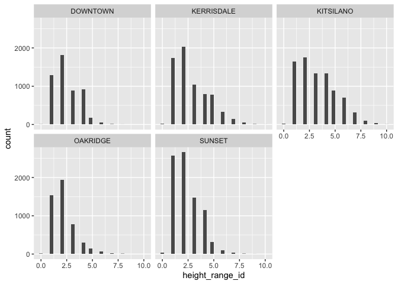

Mini Data Analysis Milestone 3
================

# Welcome to your last milestone in your mini data analysis project!

In Milestone 1, you explored your data and came up with research
questions. In Milestone 2, you obtained some results by making summary
tables and graphs.

In this (3rd) milestone, you’ll be sharpening some of the results you
obtained from your previous milestone by:

-   Manipulating special data types in R: factors and/or dates and
    times.
-   Fitting a model object to your data, and extract a result.
-   Reading and writing data as separate files.

**NOTE**: The main purpose of the mini data analysis is to integrate
what you learn in class in an analysis. Although each milestone provides
a framework for you to conduct your analysis, it’s possible that you
might find the instructions too rigid for your data set. If this is the
case, you may deviate from the instructions – just make sure you’re
demonstrating a wide range of tools and techniques taught in this class.

## Instructions

**To complete this milestone**, edit [this very `.Rmd`
file](https://raw.githubusercontent.com/UBC-STAT/stat545.stat.ubc.ca/master/content/mini-project/mini-project-3.Rmd)
directly. Fill in the sections that are tagged with
`<!--- start your work here--->`.

**To submit this milestone**, make sure to knit this `.Rmd` file to an
`.md` file by changing the YAML output settings from
`output: html_document` to `output: github_document`. Commit and push
all of your work to your mini-analysis GitHub repository, and tag a
release on GitHub. Then, submit a link to your tagged release on canvas.

**Points**: This milestone is worth 40 points (compared to the usual 30
points): 30 for your analysis, and 10 for your entire mini-analysis
GitHub repository. Details follow.

**Research Questions**: In Milestone 2, you chose two research questions
to focus on. Wherever realistic, your work in this milestone should
relate to these research questions whenever we ask for justification
behind your work. In the case that some tasks in this milestone don’t
align well with one of your research questions, feel free to discuss
your results in the context of a different research question.

# Setup

Begin by loading your data and the tidyverse package below:

``` r
library(datateachr) # <- might contain the data you picked!
library(tidyverse)
```

From Milestone 2, you chose two research questions. What were they? Put
them here.

<!-------------------------- Start your work below ---------------------------->

1.  Does the presence of a root barrier affect the diameter of trees?
    Root barriers are structures that are meant to guide tree roots down
    and away from human-made structures (e.g. building foundations, gas
    pipes, electrical wires). I am interested to see if these root
    guides have any affect on the diameter of trees.
2.  Are there any differences in the height range of all trees between
    neighbourhoods in Vancouver? Neighbourhoods have a lot of
    differences, including local climates, levels of urbanization, and
    proximity to bodies of water (among others). I would like to see if
    there is any statistically significant difference in the mean number
    of trees among Vancouver’s neighbourhoods.
    <!----------------------------------------------------------------------------->

# Exercise 1: Special Data Types (10)

For this exercise, you’ll be choosing two of the three tasks below –
both tasks that you choose are worth 5 points each.

But first, tasks 1 and 2 below ask you to modify a plot you made in a
previous milestone. The plot you choose should involve plotting across
at least three groups (whether by facetting, or using an aesthetic like
colour). Place this plot below (you’re allowed to modify the plot if
you’d like). If you don’t have such a plot, you’ll need to make one.
Place the code for your plot below.

<!-------------------------- Start your work below ---------------------------->

I don’t have such a plot (one with at least three groups), so I will
make a new one here. For my Research Question 2, I would like to compare
the differences in the distribution of height range of trees among
Vancouver neighbourhoods. Thus, for this activity, I will make a plot
that will compare the distribution of height range of trees between five
selected neighbourhoods in Vancouver.

``` r
# Here, I am filtering for 5 chosen neighbourhoods.  These are DOWNTOWN, KITSILANO, OAKRIDGE, SUNSET, and KERRISDALE.  I then group the data by the neighbourhood name.
five_neighbourhood_height <- vancouver_trees %>% filter(neighbourhood_name %in% c("DOWNTOWN", "KITSILANO", "OAKRIDGE", "SUNSET", "KERRISDALE")) %>% group_by(neighbourhood_name)

# Here, I plot a histogram showing the frequency distribution of the number of trees in each height_range_id value, faceted by neighbourhood_name.
five_group_plot <- five_neighbourhood_height %>% ggplot(aes(x = height_range_id)) +
  geom_histogram() +
  facet_wrap(~ neighbourhood_name)
  
five_group_plot
```

    ## `stat_bin()` using `bins = 30`. Pick better value with `binwidth`.

<!-- -->

<!----------------------------------------------------------------------------->

Now, choose two of the following tasks.

1.  Produce a new plot that reorders a factor in your original plot,
    using the `forcats` package (3 points). Then, in a sentence or two,
    briefly explain why you chose this ordering (1 point here for
    demonstrating understanding of the reordering, and 1 point for
    demonstrating some justification for the reordering, which could be
    subtle or speculative.)

2.  Produce a new plot that groups some factor levels together into an
    “other” category (or something similar), using the `forcats` package
    (3 points). Then, in a sentence or two, briefly explain why you
    chose this grouping (1 point here for demonstrating understanding of
    the grouping, and 1 point for demonstrating some justification for
    the grouping, which could be subtle or speculative.)

3.  If your data has some sort of time-based column like a date (but
    something more granular than just a year):

    1.  Make a new column that uses a function from the `lubridate` or
        `tsibble` package to modify your original time-based column. (3
        points)
        -   Note that you might first have to *make* a time-based column
            using a function like `ymd()`, but this doesn’t count.
        -   Examples of something you might do here: extract the day of
            the year from a date, or extract the weekday, or let 24
            hours elapse on your dates.
    2.  Then, in a sentence or two, explain how your new column might be
        useful in exploring a research question. (1 point for
        demonstrating understanding of the function you used, and 1
        point for your justification, which could be subtle or
        speculative).
        -   For example, you could say something like “Investigating the
            day of the week might be insightful because penguins don’t
            work on weekends, and so may respond differently”.

<!-------------------------- Start your work below ---------------------------->

**Task Number**: 2

The plot below will group some factor levels together into a new
category. It is modified from the plot made above. What I’ve done is
made new categories called height_level that will group trees based on
the criteria below. The criteria stipulates the groupings based on the
value of the height_range_id. The code below the criteria will make a
bar graph based on these new groupings and the plots will be faceted
based on the neighbourhood_name.

| height_range_id | height_level |
|-----------------|--------------|
| Less Than 3     | short        |
| Between 3 and 6 | medium       |
| More Than 6     | tall         |

``` r
# Based on the criteria set out above, I am creating new factors that group together trees into a new category called "height_level".  This new category will include factors called "short", "medium", and "tall" trees, based on the value of the height_range_id.
five_neighbourhood_height_categories <- five_neighbourhood_height %>% 
  mutate(height_level = case_when(height_range_id < 2 ~ "short",
                                  height_range_id < 6 ~ "medium",
                                  TRUE ~ "tall"))

head(five_neighbourhood_height_categories)
```

    ## # A tibble: 6 × 21
    ## # Groups:   neighbourhood_name [3]
    ##   tree_id civic_number std_street   genus_name species_name cultivar_name
    ##     <dbl>        <dbl> <chr>        <chr>      <chr>        <chr>        
    ## 1  149640         6968 SELKIRK ST   ACER       PLATANOIDES  COLUMNARE    
    ## 2  149683         7011 SELKIRK ST   ACER       PLATANOIDES  COLUMNARE    
    ## 3  149684         1223 W 54TH AV    ACER       PLATANOIDES  COLUMNARE    
    ## 4  149694         1292 W 49TH AV    ACER       PLATANOIDES  COLUMNARE    
    ## 5  155293          665 SMITHE ST    CARPINUS   BETULUS      <NA>         
    ## 6  155306         6510 INVERNESS ST QUERCUS    ACUTISSIMA   <NA>         
    ## # … with 15 more variables: common_name <chr>, assigned <chr>,
    ## #   root_barrier <chr>, plant_area <chr>, on_street_block <dbl>,
    ## #   on_street <chr>, neighbourhood_name <chr>, street_side_name <chr>,
    ## #   height_range_id <dbl>, diameter <dbl>, curb <chr>, date_planted <date>,
    ## #   longitude <dbl>, latitude <dbl>, height_level <chr>

``` r
# I then plot a bar graph showing the count of trees in each height_level factor, faceted by neighbourhood_name.
five_neighbourhood_height_categories %>% ggplot(aes(x = height_level)) +
  geom_bar() +
  facet_wrap(~neighbourhood_name)
```

<!-- -->
<!----------------------------------------------------------------------------->

<!-------------------------- Start your work below ---------------------------->

**Task Number**: 3

In this analysis, I have chosen to do Task Number 3 to investigate the
month that each tree was planted. I think this would be interesting
because Vancouver experiences all 4 seasons, and so I would think that
most trees would have been planted in the summer months.

``` r
# First, load the reequired packages.
suppressMessages(library(tsibble))
suppressMessages(library(lubridate))

# Extract the day and month from the date_planted.
van_trees_sep_month_day <- vancouver_trees %>% 
  mutate(day = day(date_planted),
         month = month(date_planted))

head(van_trees_sep_month_day)
```

    ## # A tibble: 6 × 22
    ##   tree_id civic_number std_street genus_name species_name cultivar_name  
    ##     <dbl>        <dbl> <chr>      <chr>      <chr>        <chr>          
    ## 1  149556          494 W 58TH AV  ULMUS      AMERICANA    BRANDON        
    ## 2  149563          450 W 58TH AV  ZELKOVA    SERRATA      <NA>           
    ## 3  149579         4994 WINDSOR ST STYRAX     JAPONICA     <NA>           
    ## 4  149590          858 E 39TH AV  FRAXINUS   AMERICANA    AUTUMN APPLAUSE
    ## 5  149604         5032 WINDSOR ST ACER       CAMPESTRE    <NA>           
    ## 6  149616          585 W 61ST AV  PYRUS      CALLERYANA   CHANTICLEER    
    ## # … with 16 more variables: common_name <chr>, assigned <chr>,
    ## #   root_barrier <chr>, plant_area <chr>, on_street_block <dbl>,
    ## #   on_street <chr>, neighbourhood_name <chr>, street_side_name <chr>,
    ## #   height_range_id <dbl>, diameter <dbl>, curb <chr>, date_planted <date>,
    ## #   longitude <dbl>, latitude <dbl>, day <int>, month <dbl>

``` r
# Group the trees into seasons based on the date planted. 
van_trees_seasons_planted <- van_trees_sep_month_day %>% 
  mutate(season_planted = case_when(month %in% c(12, 1, 2) ~ "winter",
                                  month %in% c(3, 4, 5) ~ "spring",
                                  month %in% c(6, 7, 8) ~ "summer",
                                  TRUE ~ "fall"))

van_trees_seasons_planted %>% ggplot(aes(x = season_planted)) +
  geom_bar()
```

<!-- -->

``` r
# I can also reorder the factors based on the number of trees planted in each season.

van_trees_seasons_planted %>% mutate(season_planted = fct_infreq(season_planted)) %>% 
  ggplot(aes(x = season_planted)) + 
  geom_bar()
```

<!-- -->

``` r
# Now that I've plotted the data, I'm actually surprised to see that the vast majority of trees are planted in the fall, when I would have thought that it would have occurred in the summer time.
```

<!----------------------------------------------------------------------------->

# Exercise 2: Modelling

## 2.0 (no points)

Pick a research question, and pick a variable of interest (we’ll call it
“Y”) that’s relevant to the research question. Indicate these.

<!-------------------------- Start your work below ---------------------------->

**Research Question**: Does the presence of a root barrier affect the
diameter of trees? Root barriers are structures that are meant to guide
tree roots down and away from human-made structures (e.g. building
foundations, gas pipes, electrical wires). I am interested to see if
these root guides have any affect on the diameter of trees.

**Variable of interest**: diameter

<!----------------------------------------------------------------------------->

## 2.1 (5 points)

Fit a model or run a hypothesis test that provides insight on this
variable with respect to the research question. Store the model object
as a variable, and print its output to screen. We’ll omit having to
justify your choice, because we don’t expect you to know about model
specifics in STAT 545.

-   **Note**: It’s OK if you don’t know how these models/tests work.
    Here are some examples of things you can do here, but the sky’s the
    limit.
    -   You could fit a model that makes predictions on Y using another
        variable, by using the `lm()` function.
    -   You could test whether the mean of Y equals 0 using `t.test()`,
        or maybe the mean across two groups are different using
        `t.test()`, or maybe the mean across multiple groups are
        different using `anova()` (you may have to pivot your data for
        the latter two).
    -   You could use `lm()` to test for significance of regression.

<!-------------------------- Start your work below ---------------------------->

``` r
# For this research question, my null hypothesis is that the presence of a root barrier has no effect on the mean diameter of trees.  The alternative hypothesis is that the presence of a root barrier has an effect on the mean diameter of trees.  I do not know in which direction this can have an effect, so I will do a two-tailed two-sample t test.

# I will first create a new table that only includes the columns I want.

condensed_trees <- vancouver_trees %>% select(diameter, root_barrier)
head(condensed_trees)
```

    ## # A tibble: 6 × 2
    ##   diameter root_barrier
    ##      <dbl> <chr>       
    ## 1       10 N           
    ## 2       10 N           
    ## 3        4 N           
    ## 4       18 N           
    ## 5        9 N           
    ## 6        5 N

``` r
# I will then turn the root_barrier variable into a factor.

condensed_trees$root_barrier <- as.factor(condensed_trees$root_barrier)
class(condensed_trees$root_barrier)
```

    ## [1] "factor"

``` r
levels(condensed_trees$root_barrier)
```

    ## [1] "N" "Y"

``` r
# I will also make the diameter variable into a numeric.

condensed_trees$diameter <- as.numeric(condensed_trees$diameter)
class(condensed_trees$diameter)
```

    ## [1] "numeric"

``` r
condensed_trees %>% ggplot(aes(x = root_barrier, y = diameter)) +
  geom_boxplot()
```

<!-- -->

``` r
# I can first compare the means of diameter between trees that have a root barrier (Y) and trees that do not (N).

condensed_trees %>% group_by(root_barrier) %>% summarize(mean = mean(diameter))
```

    ## # A tibble: 2 × 2
    ##   root_barrier  mean
    ##   <fct>        <dbl>
    ## 1 N            12.0 
    ## 2 Y             4.40

``` r
# As you can see, the means between the root barrier "Y" and "N" groups are different.  We can now test if this difference is statistically significant.  So now I will calculate the test statistic.

effect_of_root_barriers <- t.test(diameter ~ root_barrier, data = condensed_trees)
effect_of_root_barriers
```

    ## 
    ##  Welch Two Sample t-test
    ## 
    ## data:  diameter by root_barrier
    ## t = 188.48, df = 23961, p-value < 2.2e-16
    ## alternative hypothesis: true difference in means between group N and group Y is not equal to 0
    ## 95 percent confidence interval:
    ##  7.483398 7.640679
    ## sample estimates:
    ## mean in group N mean in group Y 
    ##        11.96242         4.40038

``` r
# As you can see, the p value is very very tiny, so it is a statistically significant difference.  Therefore, we can conclude that the presence or absence of a root barrier is associated with a statistically significant difference in the mean diameter of trees in the vancouver_trees dataset.
```

<!----------------------------------------------------------------------------->

## 2.2 (5 points)

Produce something relevant from your fitted model: either predictions on
Y, or a single value like a regression coefficient or a p-value.

-   Be sure to indicate in writing what you chose to produce.
-   Your code should either output a tibble (in which case you should
    indicate the column that contains the thing you’re looking for), or
    the thing you’re looking for itself.
-   Obtain your results using the `broom` package if possible. If your
    model is not compatible with the broom function you’re needing, then
    you can obtain your results by some other means, but first indicate
    which broom function is not compatible.

<!-------------------------- Start your work below ---------------------------->

``` r
# Load the broom package.
suppressMessages(library(broom))

# In Exercise 2.1, I calculated the mean diameter of trees based on whether or not that had a root barrier.  I saw that the calculated means are different, and then I did a t.test to determine whether or not the difference was statistically significant. We can extract information from this t.test to figure out if the difference was statistically significant based on the calculated p-value.  

# Using the broom package, we can get a tibble with a summary of the result
glance(effect_of_root_barriers)
```

    ## # A tibble: 1 × 10
    ##   estimate estimate1 estimate2 statistic p.value parameter conf.low conf.high
    ##      <dbl>     <dbl>     <dbl>     <dbl>   <dbl>     <dbl>    <dbl>     <dbl>
    ## 1     7.56      12.0      4.40      188.       0    23961.     7.48      7.64
    ## # … with 2 more variables: method <chr>, alternative <chr>

``` r
# We can also extract the p-value
p_value_root_barriers <- glance(effect_of_root_barriers)$p.value
print(p_value_root_barriers)
```

    ## [1] 0

<!----------------------------------------------------------------------------->

# Exercise 3: Reading and writing data

Get set up for this exercise by making a folder called `output` in the
top level of your project folder / repository. You’ll be saving things
there.

## 3.1 (5 points)

Take a summary table that you made from Milestone 2 (Exercise 1.2), and
write it as a csv file in your `output` folder. Use the `here::here()`
function.

-   **Robustness criteria**: You should be able to move your Mini
    Project repository / project folder to some other location on your
    computer, or move this very Rmd file to another location within your
    project repository / folder, and your code should still work.
-   **Reproducibility criteria**: You should be able to delete the csv
    file, and remake it simply by knitting this Rmd file.

<!-------------------------- Start your work below ---------------------------->

``` r
# From Exercise 1.2 in Milestone 2, I will take the summary table I generated to quantify the number of trees that are found on EVEN and ODD sides of the street.

# Code below was copied from part of my answers in Exercise 1.2 in Milestone 2.
even_vs_odd <- vancouver_trees %>% select(street_side_name) %>% summarize(num_odd = sum(street_side_name == "ODD"), num_even = sum(street_side_name == "EVEN"))
print(even_vs_odd)
```

    ## # A tibble: 1 × 2
    ##   num_odd num_even
    ##     <int>    <int>
    ## 1   71374    71753

``` r
# I already created a folder called "output" manually using my systems file explorer (Finder on my Mac), but in case you wanted the code to create a folder, here it is as well. It is commented out because I already have the folder made.

# dir.create(here::here("output"))

# I will now write the above tibble to a .csv file within the output folder.  There here::here() function is used so that this function could work if the repository / project folder is moved.

write_csv(even_vs_odd, here::here("output", "exercise3-1.csv"))
```

<!----------------------------------------------------------------------------->

## 3.2 (5 points)

Write your model object from Exercise 2 to an R binary file (an RDS),
and load it again. Be sure to save the binary file in your `output`
folder. Use the functions `saveRDS()` and `readRDS()`.

-   The same robustness and reproducibility criteria as in 3.1 apply
    here.

<!-------------------------- Start your work below ---------------------------->

``` r
# The following code will write the model object that I created in Exercise 2 to an RDS file.

saveRDS(effect_of_root_barriers, here::here("output", "exercise3-2.RDS"))

# The following code will load the RDS file that I just created.

readRDS(here::here("output", "exercise3-2.RDS"))
```

    ## 
    ##  Welch Two Sample t-test
    ## 
    ## data:  diameter by root_barrier
    ## t = 188.48, df = 23961, p-value < 2.2e-16
    ## alternative hypothesis: true difference in means between group N and group Y is not equal to 0
    ## 95 percent confidence interval:
    ##  7.483398 7.640679
    ## sample estimates:
    ## mean in group N mean in group Y 
    ##        11.96242         4.40038

<!----------------------------------------------------------------------------->

# Tidy Repository

Now that this is your last milestone, your entire project repository
should be organized. Here are the criteria we’re looking for.

## Main README (3 points)

There should be a file named `README.md` at the top level of your
repository. Its contents should automatically appear when you visit the
repository on GitHub.

Minimum contents of the README file:

-   In a sentence or two, explains what this repository is, so that
    future-you or someone else stumbling on your repository can be
    oriented to the repository.
-   In a sentence or two (or more??), briefly explains how to engage
    with the repository. You can assume the person reading knows the
    material from STAT 545A. Basically, if a visitor to your repository
    wants to explore your project, what should they know?

Once you get in the habit of making README files, and seeing more README
files in other projects, you’ll wonder how you ever got by without them!
They are tremendously helpful.

## File and Folder structure (3 points)

You should have at least four folders in the top level of your
repository: one for each milestone, and one output folder. If there are
any other folders, these are explained in the main README.

Each milestone document is contained in its respective folder, and
nowhere else.

Every level-1 folder (that is, the ones stored in the top level, like
“Milestone1” and “output”) has a `README` file, explaining in a sentence
or two what is in the folder, in plain language (it’s enough to say
something like “This folder contains the source for Milestone 1”).

## Output (2 points)

All output is recent and relevant:

-   All Rmd files have been `knit`ted to their output, and all data
    files saved from Exercise 3 above appear in the `output` folder.
-   All of these output files are up-to-date – that is, they haven’t
    fallen behind after the source (Rmd) files have been updated.
-   There should be no relic output files. For example, if you were
    knitting an Rmd to html, but then changed the output to be only a
    markdown file, then the html file is a relic and should be deleted.

Our recommendation: delete all output files, and re-knit each
milestone’s Rmd file, so that everything is up to date and relevant.

PS: there’s a way where you can run all project code using a single
command, instead of clicking “knit” three times. More on this in STAT
545B!

## Error-free code (1 point)

This Milestone 3 document knits error-free. (We’ve already graded this
aspect for Milestone 1 and 2)

## Tagged release (1 point)

You’ve tagged a release for Milestone 3. (We’ve already graded this
aspect for Milestone 1 and 2)
