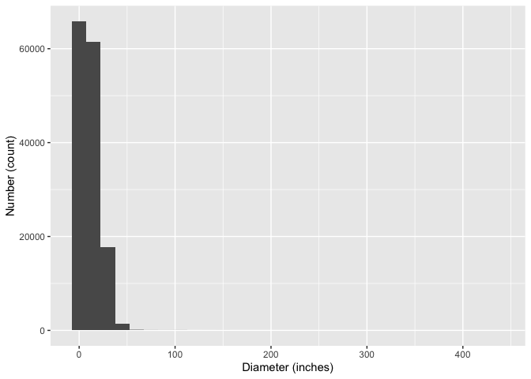
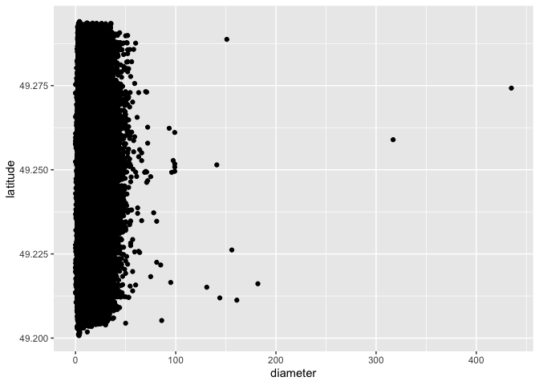
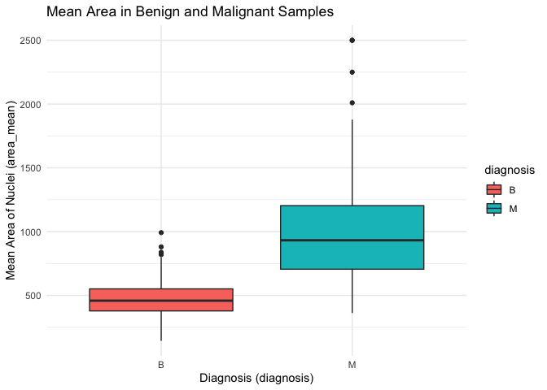

mini-data-analysis-milestone1
================
Lorenzo Lindo
07/10/2021

# STAT545A - Mini Data Analysis Project: Milestone 1 (LINDO, Lorenzo)

## Load the required packages.

Run the following code to load the required packages for this mini data
analysis.

``` r
library(datateachr)
library(tidyverse)
```

    ## ── Attaching packages ─────────────────────────────────────── tidyverse 1.3.1 ──

    ## ✓ ggplot2 3.3.5     ✓ purrr   0.3.4
    ## ✓ tibble  3.1.5     ✓ dplyr   1.0.7
    ## ✓ tidyr   1.1.4     ✓ stringr 1.4.0
    ## ✓ readr   2.0.2     ✓ forcats 0.5.1

    ## ── Conflicts ────────────────────────────────────────── tidyverse_conflicts() ──
    ## x dplyr::filter() masks stats::filter()
    ## x dplyr::lag()    masks stats::lag()

``` r
library(ggplot2)
library(dplyr)
```

## Task 1 - Exploring My Datasets of Interest

### These datasets that will be used explored for this mini data analysis.

| Dataset Number | Dataset Name     | Description of Data Set                                                                     | Credit                                                        | Dimensions                 |
|----------------|------------------|---------------------------------------------------------------------------------------------|---------------------------------------------------------------|----------------------------|
| 1              | cancer_sample    | Diagnostic Breast Cancer Data                                                               | Acquired courtesy of UCI Machine Learning Repository          | 569 rows and 32 columns    |
| 2              | steam_games      | Contains games from Steam shop with detailed data downloaded from kaggle with a CC0 license | Acquired courtesy of Kaggle                                   | 40833 rows and 21 columns  |
| 3              | building_permits | Data about the City of Vancouver’s building permits                                         | Acquired courtesy of the City of Vancouver’s Open Data Portal | 20680 rows and 14 columns  |
| 4              | vancouver_trees  | Data about Vancouver’s trees                                                                | Acquired courtesy of the City of Vancouver’s Open Data Portal | 146611 rows and 20 columns |

#### Exploring the cancer_sample dataset

``` r
head(cancer_sample) #Returns the first few rows
```

    ## # A tibble: 6 × 32
    ##         ID diagnosis radius_mean texture_mean perimeter_mean area_mean
    ##      <dbl> <chr>           <dbl>        <dbl>          <dbl>     <dbl>
    ## 1   842302 M                18.0         10.4          123.      1001 
    ## 2   842517 M                20.6         17.8          133.      1326 
    ## 3 84300903 M                19.7         21.2          130       1203 
    ## 4 84348301 M                11.4         20.4           77.6      386.
    ## 5 84358402 M                20.3         14.3          135.      1297 
    ## 6   843786 M                12.4         15.7           82.6      477.
    ## # … with 26 more variables: smoothness_mean <dbl>, compactness_mean <dbl>,
    ## #   concavity_mean <dbl>, concave_points_mean <dbl>, symmetry_mean <dbl>,
    ## #   fractal_dimension_mean <dbl>, radius_se <dbl>, texture_se <dbl>,
    ## #   perimeter_se <dbl>, area_se <dbl>, smoothness_se <dbl>,
    ## #   compactness_se <dbl>, concavity_se <dbl>, concave_points_se <dbl>,
    ## #   symmetry_se <dbl>, fractal_dimension_se <dbl>, radius_worst <dbl>,
    ## #   texture_worst <dbl>, perimeter_worst <dbl>, area_worst <dbl>, …

``` r
dim(cancer_sample) #Returns the dimensions of the dataset (how many rows and columns)
```

    ## [1] 569  32

``` r
class(cancer_sample) #Returns the class of the dataset
```

    ## [1] "spec_tbl_df" "tbl_df"      "tbl"         "data.frame"

``` r
cancer_sample %>% 
  group_by(diagnosis) %>% 
  summarise(perimeter_mean_median = mean(perimeter_mean, na.rm = TRUE))
```

    ## # A tibble: 2 × 2
    ##   diagnosis perimeter_mean_median
    ##   <chr>                     <dbl>
    ## 1 B                          78.1
    ## 2 M                         115.

#### Exploring the steam_games dataset

``` r
head(steam_games) #Returns the first few rows
```

    ## # A tibble: 6 × 21
    ##      id url    types  name  desc_snippet recent_reviews all_reviews release_date
    ##   <dbl> <chr>  <chr>  <chr> <chr>        <chr>          <chr>       <chr>       
    ## 1     1 https… app    DOOM  Now include… Very Positive… Very Posit… May 12, 2016
    ## 2     2 https… app    PLAY… PLAYERUNKNO… Mixed,(6,214)… Mixed,(836… Dec 21, 2017
    ## 3     3 https… app    BATT… Take comman… Mixed,(166),-… Mostly Pos… Apr 24, 2018
    ## 4     4 https… app    DayZ  The post-so… Mixed,(932),-… Mixed,(167… Dec 13, 2018
    ## 5     5 https… app    EVE … EVE Online … Mixed,(287),-… Mostly Pos… May 6, 2003 
    ## 6     6 https… bundle Gran… Grand Theft… NaN            NaN         NaN         
    ## # … with 13 more variables: developer <chr>, publisher <chr>,
    ## #   popular_tags <chr>, game_details <chr>, languages <chr>,
    ## #   achievements <dbl>, genre <chr>, game_description <chr>,
    ## #   mature_content <chr>, minimum_requirements <chr>,
    ## #   recommended_requirements <chr>, original_price <dbl>, discount_price <dbl>

``` r
dim(steam_games) #Returns the dimensions of the dataset (how many rows and columns)
```

    ## [1] 40833    21

``` r
class(steam_games) #Returns the class of the dataset
```

    ## [1] "spec_tbl_df" "tbl_df"      "tbl"         "data.frame"

``` r
steam_games %>% 
  group_by(genre) %>% 
  summarize(n())
```

    ## # A tibble: 1,769 × 2
    ##    genre                                                                   `n()`
    ##    <chr>                                                                   <int>
    ##  1 Accounting                                                                  2
    ##  2 Accounting,Animation & Modeling,Audio Production,Design & Illustration…     1
    ##  3 Accounting,Animation & Modeling,Audio Production,Design & Illustration…     2
    ##  4 Accounting,Education,Software Training,Utilities,Early Access               1
    ##  5 Action                                                                   2386
    ##  6 Action,Adventure                                                          809
    ##  7 Action,Adventure,Casual                                                    64
    ##  8 Action,Adventure,Casual,Early Access                                        1
    ##  9 Action,Adventure,Casual,Free to Play                                        1
    ## 10 Action,Adventure,Casual,Free to Play,Early Access                           1
    ## # … with 1,759 more rows

#### Exploring the building_permits dataset

``` r
head(building_permits) #Returns the first few rows
```

    ## # A tibble: 6 × 14
    ##   permit_number issue_date project_value type_of_work  address  project_descrip…
    ##   <chr>         <date>             <dbl> <chr>         <chr>    <chr>           
    ## 1 BP-2016-02248 2017-02-01             0 Salvage and … 4378 W … <NA>            
    ## 2 BU468090      2017-02-01             0 New Building  1111 RI… <NA>            
    ## 3 DB-2016-04450 2017-02-01         35000 Addition / A… 3732 W … <NA>            
    ## 4 DB-2017-00131 2017-02-01         15000 Addition / A… 88 W PE… <NA>            
    ## 5 DB452250      2017-02-01        181178 New Building  492 E 6… <NA>            
    ## 6 BP-2016-01458 2017-02-02             0 Salvage and … 3332 W … <NA>            
    ## # … with 8 more variables: building_contractor <chr>,
    ## #   building_contractor_address <chr>, applicant <chr>,
    ## #   applicant_address <chr>, property_use <chr>, specific_use_category <chr>,
    ## #   year <dbl>, bi_id <dbl>

``` r
dim(building_permits) #Returns the dimensions of the dataset (how many rows and columns)
```

    ## [1] 20680    14

``` r
class(building_permits) #Returns the class of the dataset
```

    ## [1] "spec_tbl_df" "tbl_df"      "tbl"         "data.frame"

``` r
building_permits %>% 
  group_by(type_of_work) %>% 
  summarize(n())
```

    ## # A tibble: 6 × 2
    ##   type_of_work                         `n()`
    ##   <chr>                                <int>
    ## 1 Addition / Alteration                10380
    ## 2 Demolition / Deconstruction           2565
    ## 3 New Building                          4728
    ## 4 Outdoor Uses (No Buildings Proposed)    27
    ## 5 Salvage and Abatement                 2763
    ## 6 Temporary Building / Structure         217

#### Exploring the vancouver_trees dataset

``` r
head(vancouver_trees) #Returns the first few rows
```

    ## # A tibble: 6 × 20
    ##   tree_id civic_number std_street genus_name species_name cultivar_name  
    ##     <dbl>        <dbl> <chr>      <chr>      <chr>        <chr>          
    ## 1  149556          494 W 58TH AV  ULMUS      AMERICANA    BRANDON        
    ## 2  149563          450 W 58TH AV  ZELKOVA    SERRATA      <NA>           
    ## 3  149579         4994 WINDSOR ST STYRAX     JAPONICA     <NA>           
    ## 4  149590          858 E 39TH AV  FRAXINUS   AMERICANA    AUTUMN APPLAUSE
    ## 5  149604         5032 WINDSOR ST ACER       CAMPESTRE    <NA>           
    ## 6  149616          585 W 61ST AV  PYRUS      CALLERYANA   CHANTICLEER    
    ## # … with 14 more variables: common_name <chr>, assigned <chr>,
    ## #   root_barrier <chr>, plant_area <chr>, on_street_block <dbl>,
    ## #   on_street <chr>, neighbourhood_name <chr>, street_side_name <chr>,
    ## #   height_range_id <dbl>, diameter <dbl>, curb <chr>, date_planted <date>,
    ## #   longitude <dbl>, latitude <dbl>

``` r
dim(vancouver_trees) #Returns the dimensions of the dataset (how many rows and columns)
```

    ## [1] 146611     20

``` r
class(vancouver_trees) #Returns the class of the dataset
```

    ## [1] "tbl_df"     "tbl"        "data.frame"

``` r
vancouver_trees %>% 
  group_by(genus_name) %>% 
  summarize(n())
```

    ## # A tibble: 97 × 2
    ##    genus_name  `n()`
    ##    <chr>       <int>
    ##  1 ABIES         190
    ##  2 ACER        36062
    ##  3 AESCULUS     2570
    ##  4 AILANTHUS       4
    ##  5 ALBIZIA         1
    ##  6 ALNUS          74
    ##  7 AMELANCHIER   226
    ##  8 ARALIA          4
    ##  9 ARAUCARIA      10
    ## 10 ARBUTUS        10
    ## # … with 87 more rows

### Narrowing down to 2 datasets of interest

| Dataset         | Why I chose this?                                                                                                                                                         |
|-----------------|---------------------------------------------------------------------------------------------------------------------------------------------------------------------------|
| cancer_sample   | I chose to continue exploring this dataset because my research is focussed on cancer and I wanted to practice data wrangling and analysis on a dataset related to cancer. |
| vancouver_trees | I chose to continue exploring this dataset because I am a born and raised Vancouverite and I really love nature, so I thought this might be very interesting.             |

### The final decision - which one will I continue analyzing?

| Dataset         | Possible Research Questions                                                                        |
|-----------------|----------------------------------------------------------------------------------------------------|
| cancer_sample   | How does the median of the mean area of nuclei compare between benign and malignant breast masses? |
| vancouver_trees | Is there a statistically significant difference in the number of trees of different genera?        |

**My Final Choice**: I will analyze the **vancouver_trees** dataset.
This will be the dataset that I will continue to explore. While the
cancer_sample dataset is interesting because my research focusses on
cancer, this dataset only contains one categorical variable and all
other variables are numerical. Since there is only one categorical
variable, it made it difficult for me to think of research questions
besides asking if there is any difference between malignant and benign
breast masses. I also thought it would be fun to explore the diversity
of trees in my hometown of Vancouver.

## Task 2 - Exploring the vancouver_trees dataset

### Some Initial Manipulation of the Datasets

#### Exercise Option 1:

Plotting the distribution of the diameter of trees. **Rationale**: This
was done to get a sense of the distribution of the diameter variable.
The following code takes the vancouver_trees dataset and generates a
histogram with diameter on the x axis and count on the y axis. This
histogram plots the distribution of the diameter of trees in this
dataset.

``` r
vancouver_trees %>% 
  ggplot(aes(x = diameter)) +
  geom_histogram() +
  xlab("Diameter (inches)") +
  ylab("Number (count)")
```

    ## `stat_bin()` using `bins = 30`. Pick better value with `binwidth`.

<!-- -->

#### Exercise Option 2:

Calculating the expected circumference of trees based on the observed
diameter and assigning it as a new variable. **Rationale**: This was
done to calculate what the expected tree circumference would be given
the observed diameter of each tree observed. The following code creates
a new variable that contains the expected circumference based on the
observed diameter of trees. It calculates circumference by multiplaying
the diameter by pi. It also relocates both the diameter and expected
circumference columns such that they appear after the std_street column.

``` r
vancouver_trees %>% 
  mutate(expected_circumference = (diameter) * pi) %>% 
  relocate(diameter, .after = std_street) %>% 
  relocate(expected_circumference, .after = diameter)
```

    ## # A tibble: 146,611 × 21
    ##    tree_id civic_number std_street    diameter expected_circumference genus_name
    ##      <dbl>        <dbl> <chr>            <dbl>                  <dbl> <chr>     
    ##  1  149556          494 W 58TH AV         10                     31.4 ULMUS     
    ##  2  149563          450 W 58TH AV         10                     31.4 ZELKOVA   
    ##  3  149579         4994 WINDSOR ST         4                     12.6 STYRAX    
    ##  4  149590          858 E 39TH AV         18                     56.5 FRAXINUS  
    ##  5  149604         5032 WINDSOR ST         9                     28.3 ACER      
    ##  6  149616          585 W 61ST AV          5                     15.7 PYRUS     
    ##  7  149617         4909 SHERBROOKE ST     15                     47.1 ACER      
    ##  8  149618         4925 SHERBROOKE ST     14                     44.0 ACER      
    ##  9  149619         4969 SHERBROOKE ST     16                     50.3 ACER      
    ## 10  149625          720 E 39TH AV          7.5                   23.6 FRAXINUS  
    ## # … with 146,601 more rows, and 15 more variables: species_name <chr>,
    ## #   cultivar_name <chr>, common_name <chr>, assigned <chr>, root_barrier <chr>,
    ## #   plant_area <chr>, on_street_block <dbl>, on_street <chr>,
    ## #   neighbourhood_name <chr>, street_side_name <chr>, height_range_id <dbl>,
    ## #   curb <chr>, date_planted <date>, longitude <dbl>, latitude <dbl>

#### Exercise Option 4:

Exploring the relationship between the diameter of the trees and the
latitude. **Rationale**: This was an exploratory analysis to see if
there is any trend between the diameter and the latitude. If you run the
following code, it doesn’t seem like there is any trend on first glance.
The following code generates a scatterplot with diameter on the x axis
and latitude on the y axis.

``` r
vancouver_trees %>% 
  ggplot(aes(x = diameter, y = latitude)) +
  geom_point() +
  xlab("Diameter (inches)") +
  ylab("Latitude")
```

    ## Warning: Removed 22771 rows containing missing values (geom_point).

<!-- -->

#### Exercise Option 6:

A boxplot looking at the height range of Vancouver trees based on
whether or not they have a root barrier installed. **Rationale**: This
was done to see if there is any difference in the height range of trees
among those trees with or without a root barrier installed. The
following code first groups the data by the presence or absence of a
root barrier, then generates a box plot. The box plot contains the
presence or absence (Y/N) of a root barrier on the x-axis, and the
height range on the y-axis. It colours the box plots based on the
presence or absence of a root barrier. I have also renamed the axes
titles and added a plot title.

``` r
vancouver_trees %>% 
  group_by(root_barrier) %>% 
  ggplot(aes(x = root_barrier, y = height_range_id, colour = root_barrier)) +
  geom_boxplot() +
  labs(title = "Frequency of Root Barriers Among Vancouver Trees" ) +
  xlab("Absence (N) or Presence (Y) of a Root Barrier") +
  ylab("Height Range (x10 feet)") +
  theme_minimal()
```

<!-- -->

## Task 3 - Writing my Research Questions

Below are my proposed research questions for this dataset. I also
include some rationale and expected outcomes

| Question Number | Research Question                                                                                                                                                                                                                                                                                                                                                                                                                                         |
|-----------------|-----------------------------------------------------------------------------------------------------------------------------------------------------------------------------------------------------------------------------------------------------------------------------------------------------------------------------------------------------------------------------------------------------------------------------------------------------------|
| 1               | Is there a significant difference in the number of trees between the East and West sides of Vancouver? I would be interested in seeing if there is any difference in the frequency of trees between the East and West sides and if this difference is statistically significant. I would need to create a new categorical variable to classify trees as either in the East or West sides (I could divide Vancouver based on longitude) then plot a graph. |
| 2               | Does the presence of a root barrier affect the diameter of trees? Root barriers are structures that are meant to guide tree roots down and away from human-made structures (e.g. building foundations, gas pipes, electrical wires). I am interested to see if these root guides have any affect on the diameter of trees.                                                                                                                                |
| 3               | Is there a difference in the frequency of tree species within a specific genus in a neighbourhood of interest? Within a specified neighbourhood (e.g. Riley Park), and within a given genus of interest (e.g. Prunus), are there any differences in the frequency among tree species?                                                                                                                                                                     |
| 4               | Are there any differences in the height range of all trees between neighbourhoods in Vancouver? Neighbourhoods have a lot of differences, including local climates, levels of urbanization, and proximity to bodies of water (among others). I would like to see if there is any statistically significant difference in the mean number of trees among Vancouver’s neighbourhoods.                                                                       |
